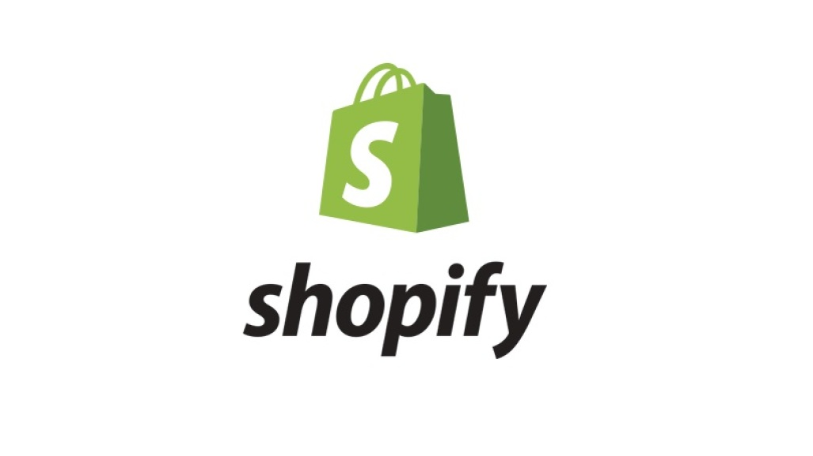

<!-- PROJECT LOGO -->
 

  

  <h3 align="center">Amanda's Shopify 2020 Data Science Challenge </h3>

  

    insert data science joke found on reddit here

<!-- ABOUT THE PROJECT -->
## About The Project

For question 1, we had to analyze the AOV calculation from Shopify and see why our AOV, average order value, was so high for shoes, a relatively . I dug a into the data and found issues why the AOV may be skewed. But when finding better ways to evalute this data, I kept wondering "what does the customer want?" Sure we can say that so and so is what happened when we calculated AOV, but why is this the case? What improvements can we make? Are we talking to Shopify or the business owners? Do they want to increase sales or website traffic? I wish I could know more about these! 

For question 2, I wanted to make my SQL queries as readable to the human eye as possible. Even if you had the faintest grasp on SQL, I wanted to make sure that that user understood what was going on. 

### Built With
* [Google Colab](https://colab.research.google.com/)
* [mySQL](https://www.mysql.com/)
* [Pandas](https://pandas.pydata.org/)
* [Python 3](https://www.python.org/)

<!-- GETTING STARTED -->
## Getting Started
There should be 2 files! I created question 1 in a Google Colab Notebook and question 2 is a .sql file 
